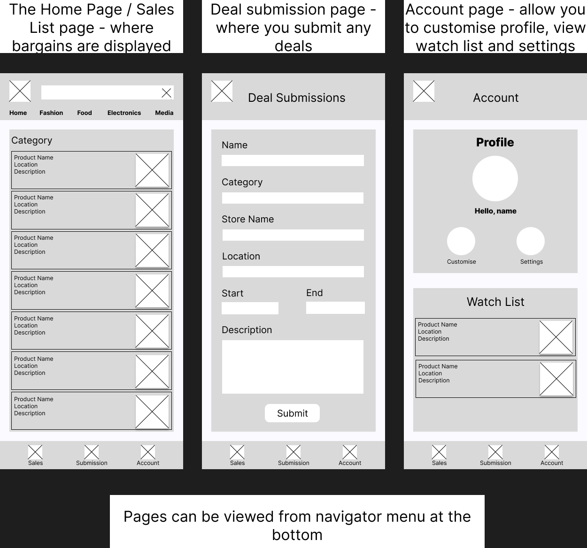

# Mobile App Design

Bargain hunter, collecting bargains you have seen and sharing them with other users in a database

# App Description

**Title**: Bargify

**Tagline**: "Find, share and save big!"

Bargify is an upcoming mobile app that aims to allow users to find the best discounts, promotions, and other bargains. Users will be able to find and share new bargains with other users, creating a community-driven platform for saving big. 

This app will boast a simplistic design to allow all types of users to navigate around, and improve ease-of-use smoothly.

# Features

### Sales list

The Sales List is the core feature of Bargify, serving as the central hub where users to view deals and bargains that have been recorded by other users. This area will house the main database that stores all the known deals that have been submitted by the users. Furthermore, the Sales List will be dynamic, meaning the list will be constantly updated to ensure the most up-to-date information.

#### Categories / Filtering and Sorting
To ensure ease of usage and access, a filtering/sorting system will be essential. Users will be able to sort deals in many different ways, such as:
- **Category** - Users can filter based on categories such as fashion, electronics, food, etc.
- **Newest Deals** - Users can filter based on the newest deals, allowing users to view fresh offers.
- **Stores** - Users can filter based on stores. The algorithms will select valid offers that are specific to the store.
- **Near User** - Users can filter coupons that are claimable within their location. The location service may be used to assist in this category.

### Deal submission

The deal submission tab is another core feature of Bargify, with the goal of allowing users to submit any deals and promotions. These submitted deals will then be transferred to the Sales List's database and viewed on the platform. Bargify is community-driven, thus users are encouraged to submit deals.

#### Submission info

- Submissions will be processed and stored in the database in the backend
- The data from the database will be exported to the Sales List frequently
- The submission details will be structured simplistically to ensure ease-of-use.
    - Names
    - Category
    - Store's name
    - Location
    - Offer's start/end time
    - A description on how to claim the deal

### Account

Account tab is a vital feature for Bargify, serving as a main way for users to engage with the app. Users need to create an account in order to utilise all the features of the app. 

#### Features that users unlock when the account is created
- Users will be able to submit deals and promotions to contribute to the community
- A wishlist system is in place to save coupons and promotions for later use
- Create personalised profiles for others to see

# Users
Many users will like to use Bargify for its straightforward, and simplistic design. Casual users, frequent or holiday shoppers, and students are the main users of Bargify.

**Casual users**

Casual users are individuals who would use the app occasionally, and are ot deeply invested in frequent use. These users engage with Bargify for specific purposes such as finding deals for specific products and within short sessions, whilst not consistently engaging with every feature. These users may choose Bargify over competitors due to our app's simplistic and easy-to-use nature.

**Frequent Shoppers**

Frequent Shoppers are individuals who would use the app regularly as a part of their shopping experience. These users engage with Bartify frequently and consistently to help them find deals before making purchases. Furthermore, these users will likely use all aspects of the app, such as adding new deals to the database.

**Students**

Students are individuals who are typically attending high school or university and are managing a tight budget, thus often need to find deals on everything. These users engage with Bartify with the primary focus on selecting deals for necessity and other means. In addition, these users will likely use all aspects of the app, such as adding new deals in the database.

# Persona
### Casual users

#### John Lee
- Age: 30
- Occupation: Bank Teller
- Status: Single
- Income Level: Middle
- Technology Proficiency: Medium

**Background:**

John is a 30-year-old bank teller. He has been working in the banking industry for five years, and now lives comfortably in his apartment. Furthermore, he loves finding great deals, especially for his occasional tech spending. His goal is to live comfortably and be able to finance his hobbies, thus bargain hunting helps him save money.

**Needs and Goal**
- Able to fund their hobbies
- Quickly be able to find deals for his hobbies

**Challenges**
- Sometimes fall into impulsive buying
- Working long shifts as a bank teller means John does not always have the time to hunt for bargains in long periods

### Frequent Shoppers

#### Amy Davis
- Age: 34
- Occupation: University professor
- Status: Married with two children (6, 8)
- Income Level: Upper-middle
- Technology Proficiency: High

**Background**

Amy is a 34-year-old professor working at one of the most prestigious universities. She is married and has two children who are currently in primary school. With two young children to take care of, shopping has been a part of her routine, and thus she constantly looks for sales to save money on essentials and other. At home, she enjoys searching for deals online and letting others on new deals as well.

**Needs and Goal**
- Keep her home stocked with essentials
- Looking for deals, often seeking out discounts
- Notifying the community of recent coupons and deals

**Challenges**
- Overbuying essentials on impulse
- Occasionally buys small items that can add up over time 

### Student

#### Fred Morse
- Age: 19
- Occupation: University Student
- Status: Single
- Income Level: Low
- Technology Proficiency: Very high

**Background**

Fred is a 19-year-old student at the local university. He lives in an on-campus accommodation with a friend, and partakes in a part-time job as a tutor to help cover expenses. Being budget-conscious has allowed Fred to make the most of his income, and finding deals is a major factor. On his free days, he regularly uses bargaining apps and catalogues to look for sales to ensure finding the best possible deals for his necessities and wants. 

**Needs and Goals**
- Due to limited income, saving money on expenses is vital
- Maximise budget via using coupons and deals to save money as a goal
- Find the best deals on everyday essentials

**Challenges**
- Temptation to overspend on deals
- Managing a tight budget 

# Wireframe

Figure 1:
- The home page is also the sales list page where all the deals are displayed and interacted with. On the top menu, there is the search bar to find deals through name or other filters, and below is a list of preset categories that the user can also use.
- The deal submissions page allows users to complete a form with information about deals they have found. Each section shall be filled to be able to create a submission.
- The account page is where settings and profile customisation are stored. Furthermore, deals can be saved via Sales List to be added to their account's watch list.
- Each page can be interacted with through the bottom navigation menu.

# Minimum viable product

A minimum viable product (MVP) will be used to assess the feasibility and as the early build of the product. For Bargify, the MVP will feature the core features of the app, as these are the main functionalities of the app. These features include:
- Sales List Page
    - The Sale List page should be able to extract information from the database and present details on any bargain deals and sales.

- Submission Page
    - The submission page should be able to allow users to send information in the input form and use the submit button, and this will be processed and sent over to the Sale List page.
- Account page
    - The account page should be able to let you to sign in with basic credentials.
    - Watch List system should be implemented for the MVP, where Sales List page favouriting will be added to the list in the Account page.

Features that **won't** be added in the minimum viable product include advanced features that do not focus on the main principle of the product, such as:
- The filtering and sorting system of the sale list will not be added in the MVP
- Customising your profile will not be in the MVP
- Settings features to change the functionality of the app, such as appearances

